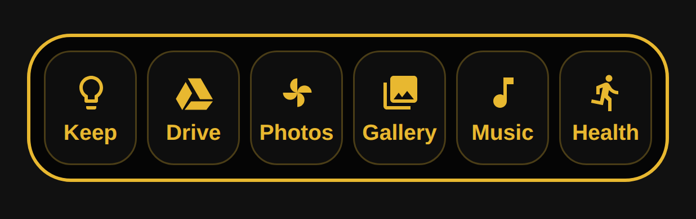

# DSR Apps widget

A home-screen widget for the Galaxy S22 Ultra in the same style as the DSR
power switch: a gold outlined rounded frame with six dark tiles, each with a
gold icon and label.

| Tile    | Opens                  | Package                          |
|---------|------------------------|----------------------------------|
| Keep    | Google Keep            | `com.google.android.keep`        |
| Drive   | Google Drive           | `com.google.android.apps.docs`   |
| Photos  | Google Photos          | `com.google.android.apps.photos` |
| Gallery | Samsung Gallery        | `com.sec.android.gallery3d`      |
| Music   | Samsung Music          | `com.sec.android.app.music`      |
| Health  | Samsung Health         | `com.sec.android.app.shealth`    |

If an app isn't installed, its tile opens the Play Store page for it.



## Install

1. On the phone, open the repo's **Releases** → **DSR Apps widget (latest build)**
   and download `DSR-Apps-Widget.apk` (rebuilt by GitHub Actions on every push
   that touches this folder).
2. Open the APK and allow "Install unknown apps" for your browser when asked.
3. Long-press an empty spot on the home screen → **Widgets** → **DSR Apps**,
   and drag it onto the screen. It fills 4 columns by 1 row and can be resized.

## Build locally

```
cd DSRAppsWidget
./gradlew assembleDebug   # -> app/build/outputs/apk/debug/app-debug.apk
```
